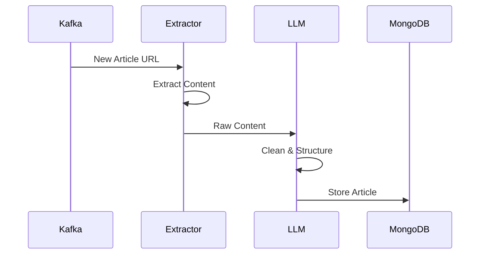
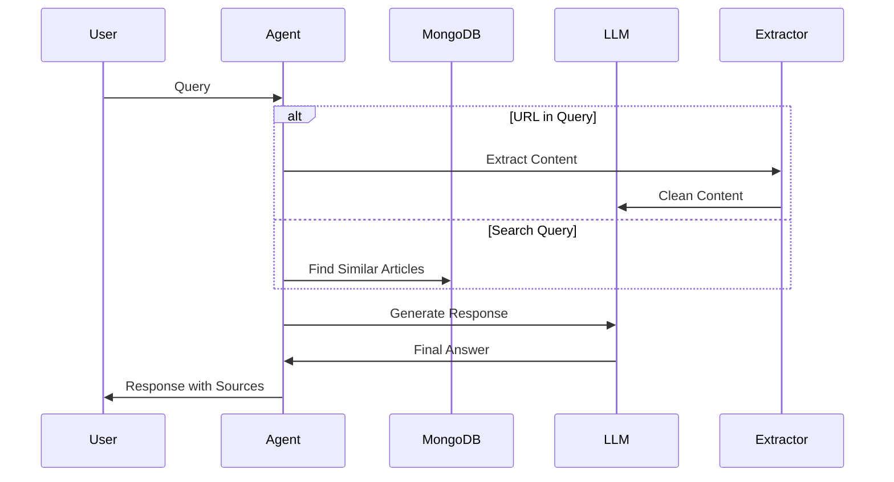

# News Article Agent

Node.js-based query-response application that integrates with a large language model (LLM) to create a Retrieval-Augmented Generation (RAG) system using a vector database.

## Prerequisites

- Node.js 18+
- MongoDB Atlas account
- Kafka cluster
- Google Gemini API key

## Environment Setup

Create a `.env` file in the root directory:

```env
# MongoDB Configuration
MONGODB_URI=your_mongodb_uri

# Kafka Configuration
KAFKA_BROKER=your_kafka_broker
KAFKA_USERNAME=your_kafka_username
KAFKA_PASSWORD=your_kafka_password
KAFKA_TOPIC_NAME=news
KAFKA_GROUP_ID_PREFIX=test-task-

# LLM Configuration
GEMINI_API_KEY=your_gemini_api_key
```

## Installation & Running

### Using npm
1. Install dependencies
```
npm install
```

2. Run the application
```
npm run start
```

### Using Docker
```
docker-compose up --build
```

## API Usage
Query Endpoint request example
```
curl -X POST http://localhost:3000/agent -H "Content-Type: application/json" -d '{"query": "Tell me the latest news about Trudeau"}'
```

Response example
```
{
    "answer":"Canadian Prime Minister Justin Trudeau announced his resignation...",
    "sources":[
        {
            "title":"Canada's Justin Trudeau cites 'internal battles' as he ends nine-year run",
            "url":"https://www.bbc.com/news/articles/c878ryr04p8o",
            "date":"2025-02-04T22:50:27.775Z"
        }
    ]
}
```

## Architecture & Design Decisions

### System Components Overview
The project leverages NestJS as the core framework, utilizing its modular architecture and dependency injection system to organize the codebase into distinct modules.

### Key Components

- Kafka Service: Handles real-time article ingestion.
- Content Extractor: Cleans and extracts relevant content from articles.
- LLM Service: Manages interactions with the Language Model (Gemini) for content cleaning and query responses.
- Article Service (MongoDB Integration): Manages article storage and retrieval with text search capabilities.
- Agent Service: Orchestrates the query-response flow and combines different services.

### Data Flow and Processing
1. Article Ingestion Flow:

2. Query Processing Flow:


## Areas for Improvement

### Performance Optimizations
- Add connection pooling for MongoDB
- Use worker threads for content processing

### Cost Optimization
- Implement token usage tracking
- Add caching layer for LLM responses
- Use chunking for large documents
- Optimize prompt engineering to reduce token usage

### Quality Improvements
- Implement fact-checking mechanisms
